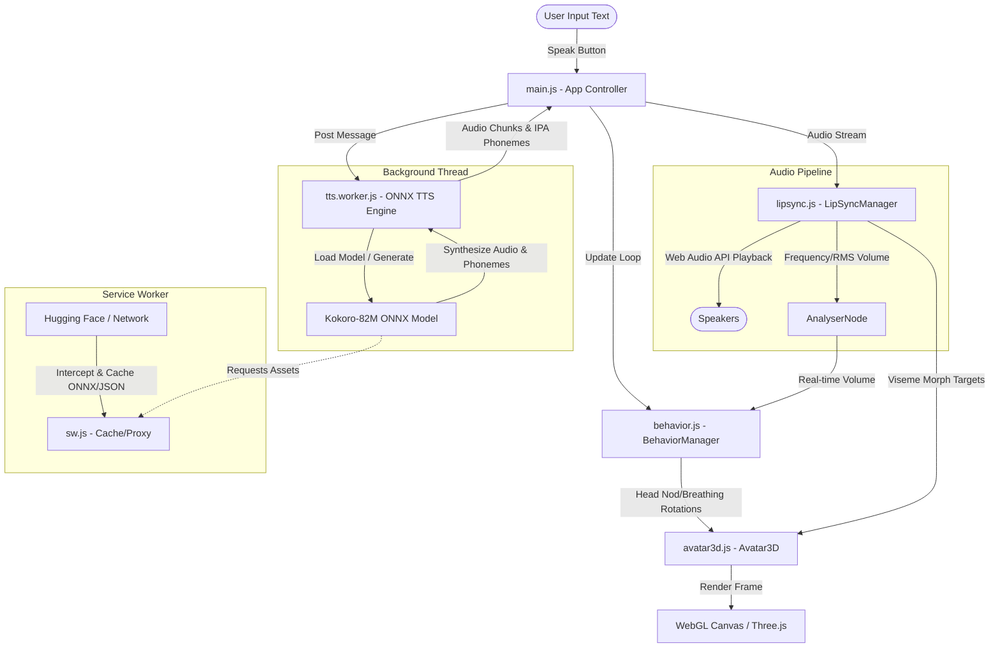

# System Design and Architecture: 3D Digital Human

This document provides a comprehensive technical overview of the browser-based 3D Digital Human project. The application renders a rigged 3D human head/avatar in real-time WebGL, performs local Text-to-Speech (TTS) using a neural network, and drives procedural animations (breathing, blinking, head bobbing, eye saccades, and lip-syncing).

---

## 1. System Architecture

The application is structured into modular components operating in both the main browser thread and background service/worker threads.



---

## 2. Technology Stack

* **Vite**: Ultra-fast build tool and local development server utilizing native ES Modules.
* **Three.js (WebGL)**: High-performance 3D library used to manage the scene, lighting, camera framing, orbit controls, and skeletal bone/morph-target transforms.
* **Kokoro.js & @huggingface/transformers**: A javascript port of the Kokoro-82M speech synthesizer running local ONNX Runtime inference using WebAssembly (WASM) or WebGPU.
* **Web Audio API**: Low-latency audio framework used for queueing PCM audio chunks, reading real-time waveform data, and playing back speech.
* **Service Worker API**: Intercepts model requests to implement offline caching of the 45MB-170MB ONNX and JSON files.

---

## 3. Core Components

### 1. App Controller ([main.js](file:///e:/Simplyfi/avatar-project/v3/main.js))
* **Role**: Coordinates the instantiation and frame loop of the application.
* **Key Tasks**:
  * Registers the Service Worker (`sw.js`).
  * Initializes the `Avatar3D`, `BehaviorManager`, and `LipSyncManager`.
  * Spawns and manages communications with the Web Worker (`tts.worker.js`).
  * Drives the render loop using `requestAnimationFrame(renderLoop)` at 60 FPS.

### 2. Neural TTS Worker ([tts.worker.js](file:///e:/Simplyfi/avatar-project/v3/src/tts.worker.js))
* **Role**: Offloads speech inference from the main thread to prevent UI stuttering.
* **Key Tasks**:
  * Instantiates the Hugging Face Kokoro ONNX model pipeline.
  * Translates input text into phoneme tokens.
  * Generates raw PCM audio samples (Float32Array) at 24kHz.
  * Dispatches audio chunks and phoneme timelines back to the main thread.

### 3. Lip-Sync Engine ([lipsync.js](file:///e:/Simplyfi/avatar-project/v3/src/lipsync.js))
* **Role**: Schedules and aligns the avatar's lip blendshapes with the playing audio.
* **Key Tasks**:
  * Maps IPA (International Phonetic Alphabet) characters to **Oculus/ARKit visemes** (e.g. `viseme_PP`, `viseme_FF`, `viseme_aa`).
  * Manages audio pre-roll buffering (`bufferThreshold = 2`) to ensure contiguous, stutter-free playback.
  * Calculates proportional phoneme durations based on phonetic weights (e.g. vowels last longer than stops).
  * Computes real-time Root Mean Square (RMS) volume from the playing stream using an `AnalyserNode`.

### 4. Behavior & Animation Manager ([behavior.js](file:///e:/Simplyfi/avatar-project/v3/src/behavior.js))
* **Role**: Generates life-like secondary procedural motion.
* **Key Tasks**:
  * **Breathing**: Sinusoidal sway affecting vertical positioning and neck pitch.
  * **Blinking State Machine**: Triggers organic single and double blinks at random intervals (3–6s).
  * **Gaze Saccades**: Randomly shifts eye coordinate targets slightly to simulate active viewing.
  * **Speech Bobbing**: Uses the RMS volume from the lip-sync module to generate micro-rotations (head nodding/tilting) corresponding to speech cadence.

### 5. 3D Renderer ([avatar3d.js](file:///e:/Simplyfi/avatar-project/v3/src/avatar3d.js))
* **Role**: Handles 3D asset loading, lighting, and hardware-accelerated rendering.
* **Key Tasks**:
  * Loads the rigged GLB model and configures materials (roughness, metalness) for skin rendering.
  * Automatically frames the camera on the model's head bounding box.
  * Locates target bones (Head, Neck, LeftArm, RightArm, LeftForeArm, RightForeArm, LeftEye, RightEye) and registers morph target dictionaries.
  * Applies procedural rotations to arms (A-pose sway) and head (idle/nodding sways).
  * Applies morph target values to blendshapes during rendering.

### 6. Service Worker Caching ([sw.js](file:///e:/Simplyfi/avatar-project/v3/public/sw.js))
* **Role**: Prevents re-downloading massive model assets on every page load.
* **Key Tasks**:
  * Caches static page assets (`/`, `/index.html`, `/index.css`, `/main.js`) in `avatar-app-cache-v1` using a stale-while-revalidate approach.
  * Intercepts model requests to `huggingface.co` or `.onnx`/`.json` endpoints, saving them to `kokoro-model-cache`.

---

## 4. Speech and Lip-Sync Data Flow

The lip-sync pipeline executes in 6 distinct stages:

```
[Text Input]
     │
     ▼
[Phonemization (G2P)] ──► Translates "Hello" into IPA string: "həˈloʊ"
     │
     ▼
[Inference Model]     ──► Generates 24kHz audio floats & maps phoneme timestamps
     │
     ▼
[Web Audio Queue]     ──► Schedules audio playback at `nextPlayTime` on Web Audio Context
     │
     ▼
[Phoneme Alignment]   ──► Distributes total duration to "h", "ə", "l", "oʊ" based on phonetic weights
     │
     ▼
[Viseme Mapping]      ──► Maps "oʊ" to `viseme_O: 1.0` and `viseme_sil: 0.0`
     │
     ▼
[Coarticulation LERP] ──► Smoothly transitions current mesh morph target weights towards targets
     │
     ▼
[WebGL Draw]          ──► GPU morphs the vertex shader and renders frame
```

---

## 5. Procedural Skeleton Rigging

Humanoid avatars require structural adjustments to look organic:
* **T-Pose to A-Pose**: Ready Player Me and Mixamo models are loaded in a horizontal T-pose. `relaxArms()` stores the original bone rotations, and `updateArmSways()` applies Z-axis pitch offsets (`-1.15` radians on the left arm, `+1.15` on the right) to drop them to a natural hanging posture.
* **Eye Movements**: Eye nodes (`LeftEye`, `RightEye`) are rotated using standard skeletal coordinate limits (`maxAngle = 0.22` radians). If the model uses blendshapes instead of skeletal eye joints, the system falls back to updating ARKit morphs (`eyeLookOutLeft`, `eyeLookInRight`, etc.).
